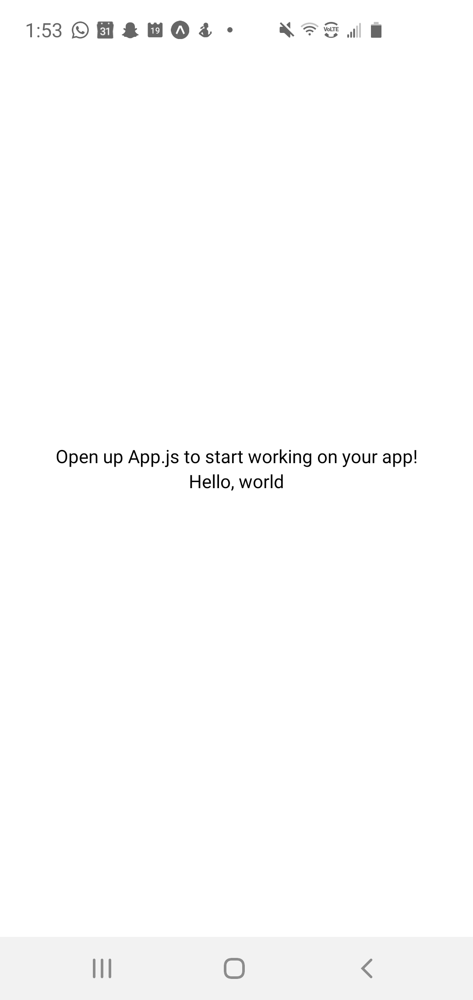
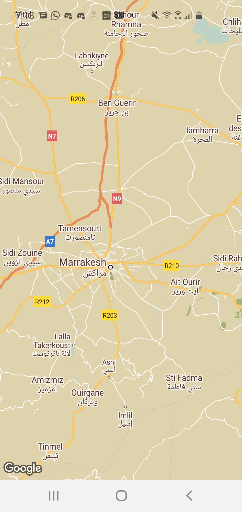
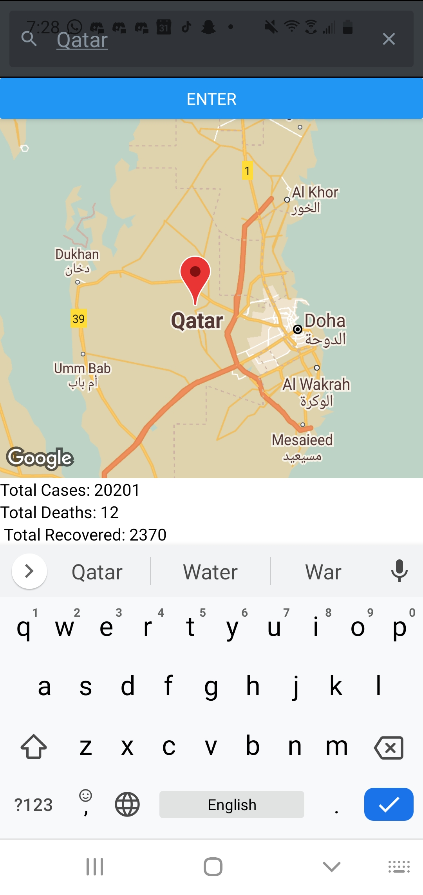
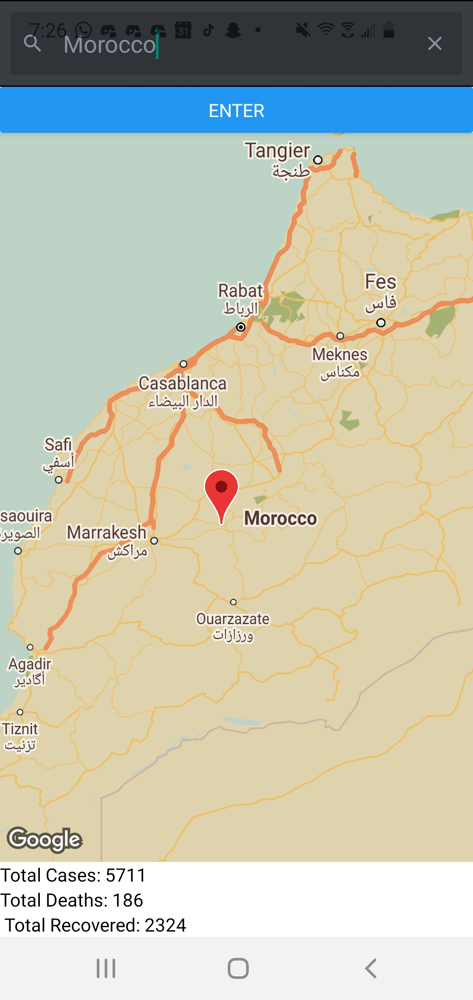

# covid19-app-NoahMalhi
covid19-app-NoahMalhi created by GitHub Classroom

### Hello World using Expo. 

Used "npm install -g expo-cli" to download expo for a react cross platform tool.

Initilized the project using:
expo init AwesomeProject

In the project direcotry ran the following to begin the development server.
expo start

The code for this was originally in Awesomeproject folder App.js file but I overwrote this with the map.

Following is a screenshot of the helloworld app running on an android.
  

### Using a map with React

To make the map I used react-native-maps. To use this I installed it using "npm install -g react-native-maps".
The documentation used was from https://github.com/react-native-community/react-native-maps.
From that I was able to assemble a basic map.
I set the intial map to show the city of Marakech, Morocco. For my color theme I used a google maps color style generator. I was able to choose my color theme and google would generate a json from it.

The code is in the Awesomeproject directory in the App.js file.

The following is a screenshot of the app in use on an android.
  

### Overlaying covid Data

My covid app takes in a user input via a searchbar. This input is the name of a country. This country input is used with two different apis. The geocoder api is used to get the longitude and latitude to add a marker to the map and relocate the position of the map to that marker. The covid api is used to get country data to find the total deaths, total, recovered, and the total cases of covid within that state. To use the app one just needs to input the country into the searchbar, the press enter. The following is the result of searching various countries:

  

  

All the above is overlayed onto the map done in the previous steps.
